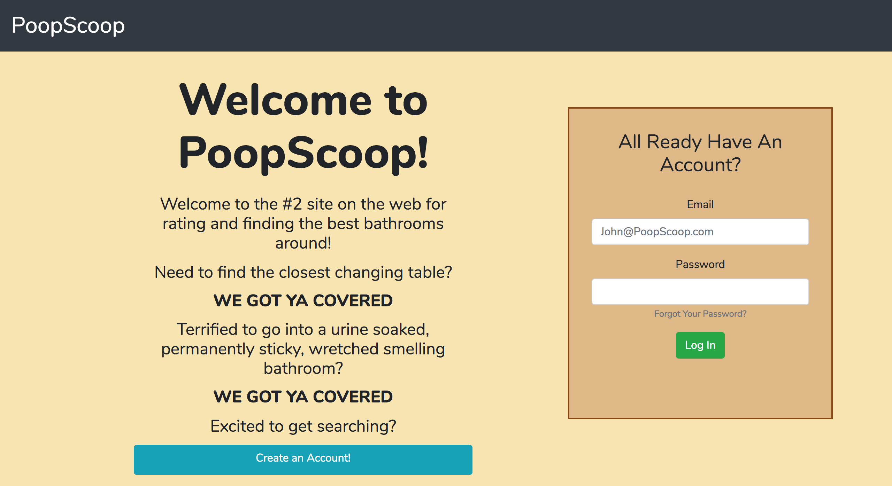
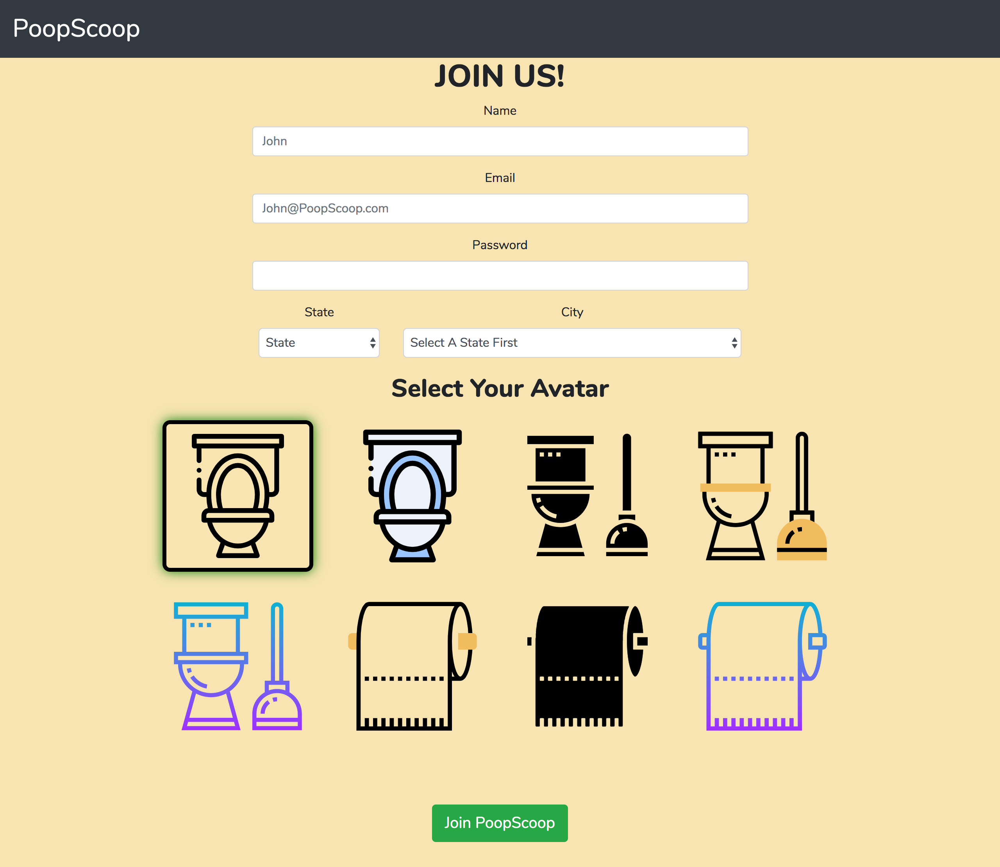
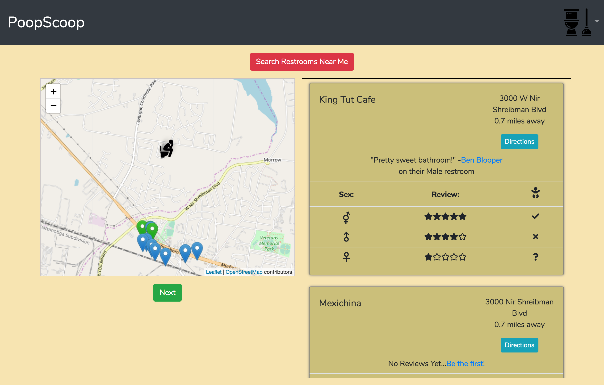
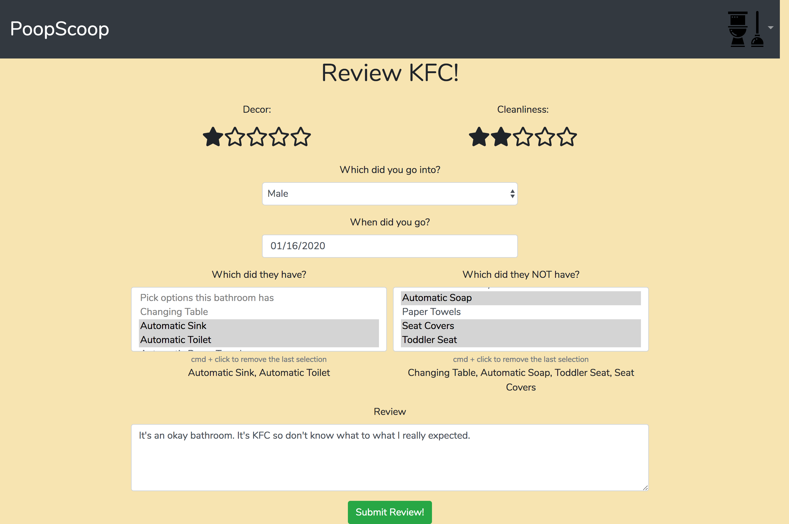
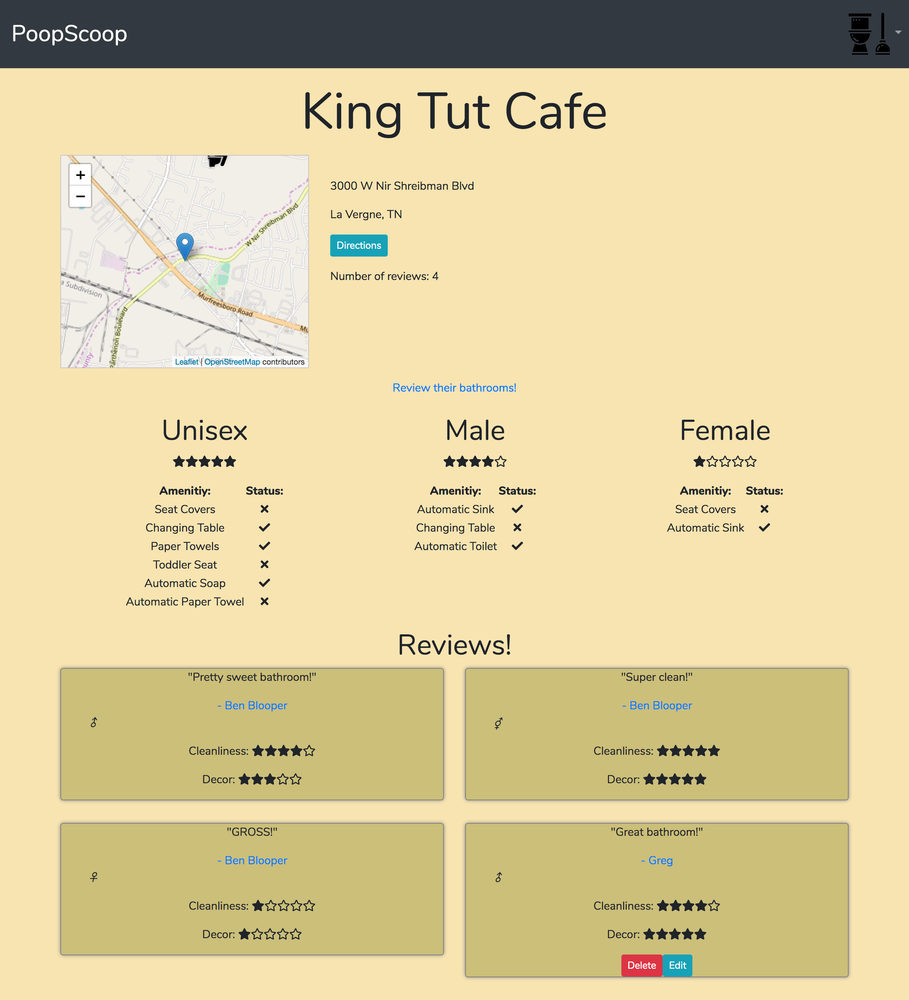
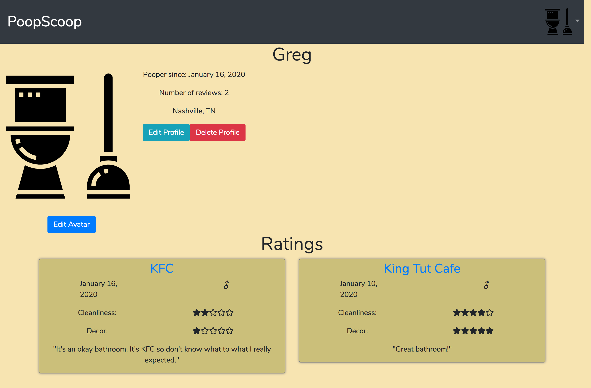

# PoopScoop

## Description
A way to rate and review restrooms around your area. Great for people with kids who need access to changing tables or for people who just enjoy a clean restroom!
Everything is styled for mobile, tablets and desktop computers.

## Screenshots

#### Landing Page
What you see on page load before you log in or create an account

#### Create Account
The new user sign up page. The city option populates depending on the state option picked.
Allows the user to pick an avatar.

#### Home Page
Allows the user to search restrooms around their location. Places that have already been reviewed are shown as a green marker while others are blue. The average ratings show up next to the map in desktop view, split between male, female and unisex, whether or not they have a changing table along with a single review. From here you can click the business page to see all reviews, click a user that reviewed to see all their reviews, get directions to the business of your choice or click the next button to search more restrooms in the same area.

#### Review Page
You can rate the decor and cleanliness out of 5.
You have to pick which restroom you went into, then the date.
The amenities the restrooms have or don't options have are directly related to what has already been selected for them to prevent conflicting data. You also can't select both for having or not having.
Then you must fill out a review.

#### Business Page
The single business page shows every review for that business and breaks the restrooms into male, female and unisex with their respective ammenities that they do or do not have. You also have a map of its location and an ability to get directions.

#### User Profile
The user profile is a way to see every review a user has added. If you are logged in as that user you have the ability to edit your name or location as well as your avatar. You can also edit any of your reviews if you changed your mind. Also you can delete your entire account.

This project was bootstrapped with [Create React App](https://github.com/facebook/create-react-app).

## Available Scripts

In the project directory, you can run:

### `npm start`

Runs the app in the development mode. 
Open [http://localhost:3000](http://localhost:3000) to view it in the browser.

The page will reload if you make edits. 
You will also see any lint errors in the console.

### `npm test`

Launches the test runner in the interactive watch mode. 
See the section about [running tests](https://facebook.github.io/create-react-app/docs/running-tests) for more information.

### `npm run build`

Builds the app for production to the `build` folder. 
It correctly bundles React in production mode and optimizes the build for the best performance.

The build is minified and the filenames include the hashes. 
Your app is ready to be deployed!

See the section about [deployment](https://facebook.github.io/create-react-app/docs/deployment) for more information.

### `npm run eject`

**Note: this is a one-way operation. Once you `eject`, you can’t go back!**

If you aren’t satisfied with the build tool and configuration choices, you can `eject` at any time. This command will remove the single build dependency from your project.

Instead, it will copy all the configuration files and the transitive dependencies (Webpack, Babel, ESLint, etc) right into your project so you have full control over them. All of the commands except `eject` will still work, but they will point to the copied scripts so you can tweak them. At this point you’re on your own.

You don’t have to ever use `eject`. The curated feature set is suitable for small and middle deployments, and you shouldn’t feel obligated to use this feature. However we understand that this tool wouldn’t be useful if you couldn’t customize it when you are ready for it.

## Learn More

You can learn more in the [Create React App documentation](https://facebook.github.io/create-react-app/docs/getting-started).

To learn React, check out the [React documentation](https://reactjs.org/).

### Code Splitting

This section has moved here: https://facebook.github.io/create-react-app/docs/code-splitting

### Analyzing the Bundle Size

This section has moved here: https://facebook.github.io/create-react-app/docs/analyzing-the-bundle-size

### Making a Progressive Web App

This section has moved here: https://facebook.github.io/create-react-app/docs/making-a-progressive-web-app

### Advanced Configuration

This section has moved here: https://facebook.github.io/create-react-app/docs/advanced-configuration

### Deployment

This section has moved here: https://facebook.github.io/create-react-app/docs/deployment

### `npm run build` fails to minify

This section has moved here: https://facebook.github.io/create-react-app/docs/troubleshooting#npm-run-build-fails-to-minify

#### Author
# Greg Stephen

## Deployed at
https://poopscoop-83db3.web.app/